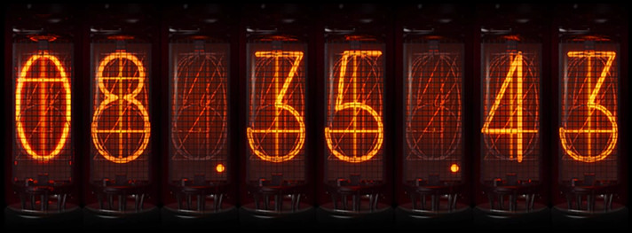

# Divergence Clock
Android divergence meter widget like that in Steins;Gate, but as a clock.

### Features
- Accurate system time synced clocks
- Power saving mode
- Animation when tubes are touched

### Images
Full Clock:

Simple Clock:

## Download
https://github.com/Sonicaii/Divergence/releases

### Future features
- Customise animation
- Upload and use custom images
